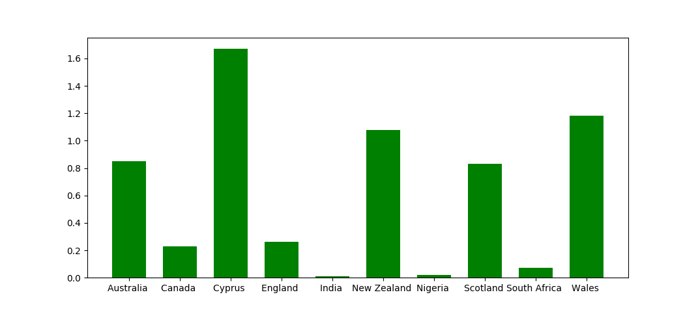

# Medals Analyser

Medals Analyser is a project to help visualise the effect of population on the outcome of a sporting event in terms of medals won.

It is written in Python and reads in a single .csv file before determing the medal:population ratio and dislays it in a bar graph.

Functionality
-------------
The script reads a .csv file of composition: "[countryName][medalCount]" and then scrapes wikipedia for population data of that country. Then, a ratio of population to medals won is calculated, before being displayed by a matplotlib bar graph.

## This project uses
This project uses the following modules:
<li> <a href = "https://github.com/requests/requests">Requests </a>, a module used for processing http requests
<li> <a href = "https://docs.python.org/3/library/csv.html">csv</a>, a standard library module used for reading and writing csv files.
<li> <a href = "https://matplotlib.org/"> Matplotlib </a>, a module used for creating graphs and charts in Python

## Sources of Data:
The medal data is from Wikipedia, and the population data is scraped from Wikipedia too. As a result, all data is open-source.  

## Example Output

The following output id based on the example data in <a href = "input.csv">input.csv. </a>

